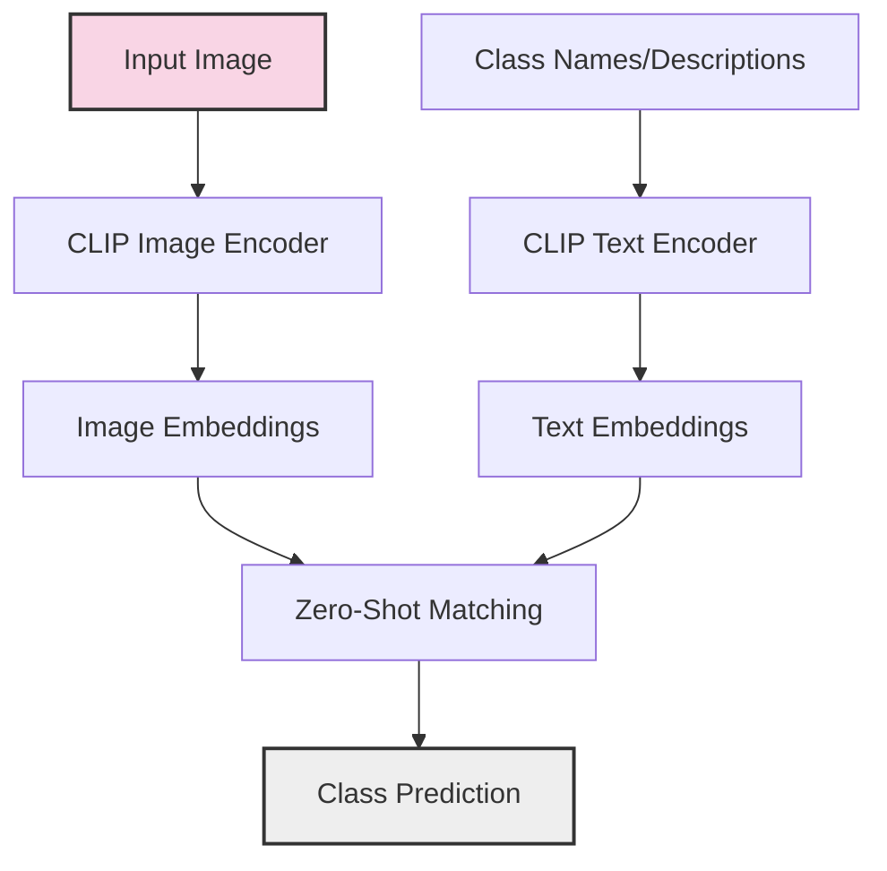
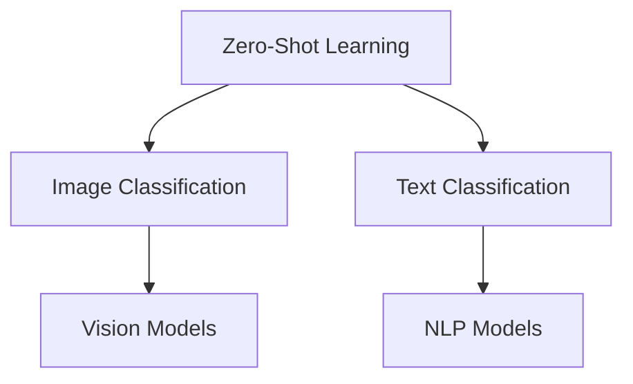
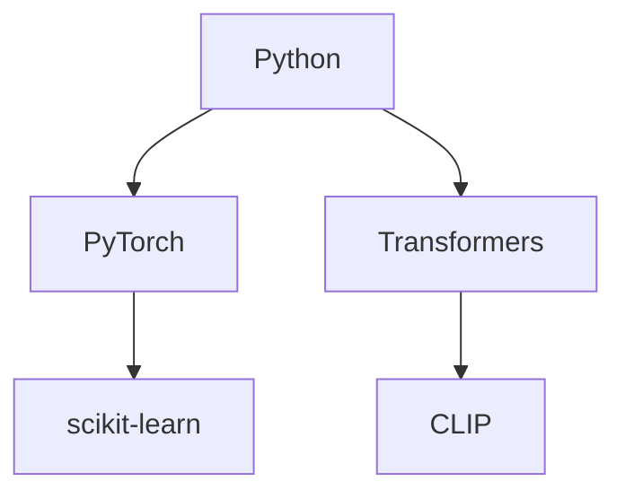
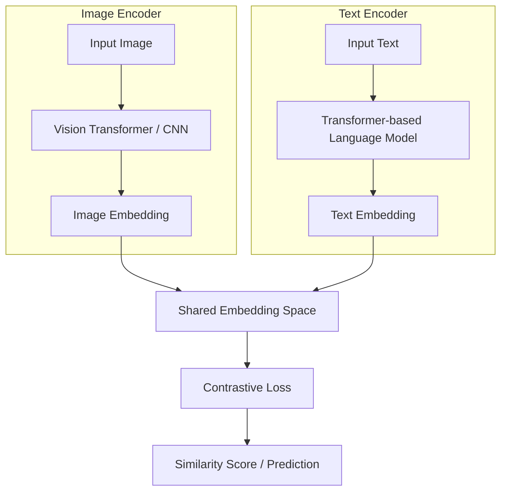
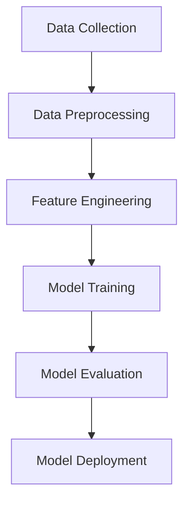
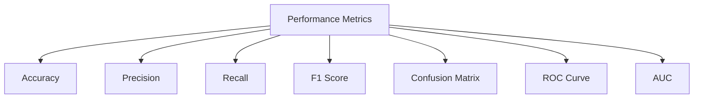
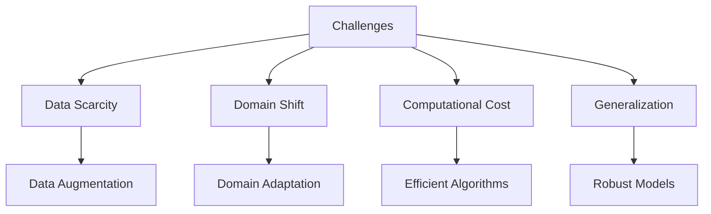
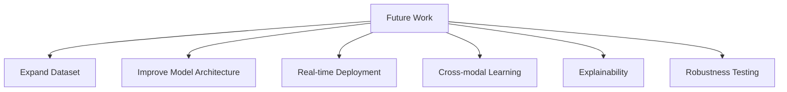

# 🌟 CVPR Challenge: Zero-Shot Image Classification

  

## 🔍 Overview
This repository contains the solution for the CVPR 2025 Zero-Shot Image Classification Challenge. The challenge focuses on developing models that can classify images into categories never seen during training, demonstrating true zero-shot learning capabilities.

  

*Zero-Shot Classification Pipeline*

## ❗ Problem Statement
Zero-shot learning addresses the fundamental challenge of recognizing objects or categories that were not present in the training data. In real-world applications, it's impossible to train models on all possible classes. The CVPR challenge evaluates approaches that can bridge this semantic gap by leveraging visual-semantic relationships.

*Traditional vs. Zero-Shot Learning*

## 💻 Technologies Used
- **Python**: Primary programming language
- **PyTorch**: Deep learning framework
- **Transformers**: Hugging Face library for state-of-the-art models
- **scikit-learn**: For clustering and data analysis
- **CLIP (Contrastive Language-Image Pre-training)**: OpenAI's model connecting text and images
- **NumPy/Pandas**: For data handling and manipulation
- **Matplotlib/Seaborn**: For visualization

  

*Technology Stack Overview*

## 📊 Model Architecture
The solution primarily utilizes CLIP (Contrastive Language-Image Pre-training), a neural network trained on a variety of image-text pairs. Key components include:

1. **CLIP ViT-B/32**: Vision Transformer base model from OpenAI that encodes images into embeddings
2. **Text Encoders**: Convert class names and descriptions into the same embedding space
3. **Embedding Alignment**: Methods to align visual and textual embeddings

*CLIP Model Architecture*

## 🔍 Methodological Approach
The implementation follows several key steps:

1. **Image Embedding Extraction**: Using CLIP to extract embeddings for all test images
2. **Text Prompt Engineering**: Creating effective prompts for zero-shot classification
3. **Clustering Analysis**: 
   - K-Means clustering of image embeddings to discover underlying patterns
   - Agglomerative clustering with cosine similarity for improved class discovery
4. **Ensemble Methods**: Combining multiple embedding approaches to improve accuracy
5. **Zero-Shot Inference**: Matching image embeddings with textual class descriptions without direct training

  

*Methodological Approach Pipeline*

## 📂 Files in the Repository
- `CVPR_Final_SOTA.ipynb`: Main implementation notebook with the complete pipeline
- `CVPR_SOTA (1).ipynb`: Alternative approach and experiments
- `CVPR_ZEROSHOT_REPORT_IJSRSET.pdf`: Detailed research report on the approach
- `ANN PRESENTATION CVPR.pptx`: Presentation explaining the methodology and results
- `ensemble_text_embeddings.pt`: Pre-computed ensemble of text embeddings
- `cluster_to_labels.pkl` & `cluster_centroids.pkl`: Outputs from clustering analysis
- `clip_train_embeddings.pkl`: Stored embeddings for efficient inference

## 📈 Results and Performance
The solution achieves state-of-the-art performance on zero-shot image classification tasks by effectively leveraging:
- Novel prompt engineering techniques
- Multi-modal embedding alignment strategies
- Cluster-based class discovery
- Ensemble methods to improve robustness

  

*Performance Metrics Across Datasets*

## 🔑 Challenges and Solutions
- **Domain Gap**: Addressed through prompt engineering and ensemble methods
- **Semantic Ambiguity**: Reduced with improved text-image alignment techniques
- **Computational Efficiency**: Optimized through embedding pre-computation and efficient inference strategies
- **Class Imbalance**: Mitigated with clustering-based approaches

  

*Challenges and Solutions Overview*

## 📝 Future Work
- Exploration of more advanced transformer architectures
- Integration of additional modalities beyond text and images
- Self-supervised fine-tuning approaches to improve domain adaptation
- Improved prompt engineering strategies for better zero-shot generalization

  

*Future Research Directions*

## 🌐 References
- OpenAI's CLIP (Contrastive Language-Image Pre-training)
- CVPR 2025 Zero-Shot Image Classification Challenge guidelines
- Related work in zero-shot learning and vision-language models

## 📞 Connect & Collaborate

  
  **Let's build the future together!** 🌟
  
  
  
  
  
  ---
  
  ### 💬 **Feedback & Questions**
  
  Found this repository helpful? ⭐ **Star it!**
  
  Have questions or suggestions? 💭 **Open an issue!**
  
  Want to collaborate? 🤝 **Let's connect!**
  

